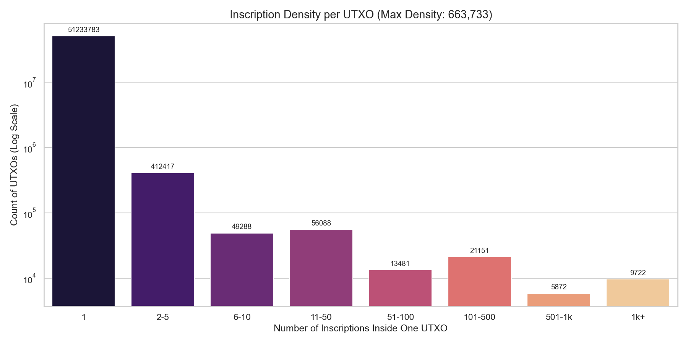

# Stats and Charts for The Cat

This directory contains supporting statistics and visualizations for  
**The Cat: Non-Monetary UTXO Cleanup**.

These numbers and charts are **non-normative**: they illustrate the scale and
structure of inscription-related UTXOs, but they do not by themselves define
any consensus constants.

---

## Snapshot metrics (Ord inscriptions)

As of block **926301**:

- Total inscriptions: **112,568,163**
- UTXOs containing at least one inscription: **51,801,803**

Global UTXO set and impact of inscribed dust at the same height:

- **Total global UTXOs (Bitcoin Core):** **165,113,035**
- **Inscribed dust UTXOs (< 1,000 sats):** **49,903,318**

Impact summary:

- **Bloat by count:** inscribed dust is ~**30.2%** of all UTXO entries  
  (49,903,318 / 165,113,035).
- **Serialized UTXO set size on disk:** **10.80 GB** (Bitcoin Core `gettxoutsetinfo`).
- **Estimated inscribed dust size:** **4.18 GB**, or ~**38.7%** of the
  serialized UTXO set’s disk footprint.

In other words, removing only these dust-sized inscription UTXOs would remove
roughly **30% of entries** and free up almost **40% of the UTXO set bytes** at
this snapshot.

---

## Actual UTXO count by value

This chart shows the *actual* distribution of inscription-bearing UTXOs by
value bucket, on a log scale, with raw counts annotated.

---

## Distribution of UTXO values (dust vs. whales)

This chart emphasizes how many inscription-bearing UTXOs are dust-sized
compared to the smaller population of large “whale” outputs.

---

## Inscription activity over time

This chart shows how many inscriptions were minted per block, highlighting the
bursty, high-intensity periods of inscription activity across the Ordinals era.

---

## Growth of the inscribed UTXO set

Here we plot the cumulative number of unique UTXOs that contain inscriptions as
a function of block height, making the rapid growth of the inscribed UTXO set
visually clear.

---

## Inscription density per UTXO

This chart shows how many inscriptions are packed into each UTXO (1, 2–5, 6–10,
…, 1k+), on a log scale. It highlights the existence of extremely dense carrier
UTXOs, including ones with hundreds of thousands of inscriptions.

---

## Global UTXO set size impact

This chart summarizes the estimated share of the global UTXO set’s disk usage
consumed by dust-sized inscribed outputs versus all other UTXOs.

At the 926301 snapshot:

- The serialized UTXO set (`chainstate` directory) occupies **10.80 GB** of disk.
- Dust-sized inscription UTXOs (< 1,000 sats) are estimated to consume about
  **4.18 GB** of that.
- That corresponds to roughly **38.7%** of UTXO-set bytes dedicated to
  inscription dust alone.

Under The Cat, these UTXOs become permanently unspendable and may be safely
pruned from the serialized UTXO set, recovering most of this footprint.

---

## Data methodology & disclosures

- **Synchronization:** Data snapshots for both the Ordinals index and the
  Bitcoin Core node were frozen at block height **926301**.

- **Scope:** “Inscribed dust” is strictly defined as UTXOs containing an
  inscription with a value of **< 1,000 satoshis**.

- **Size estimation:**  
  Global state size is taken from actual Bitcoin Core disk usage
  (`gettxoutsetinfo`). Inscribed dust size is a theoretical estimate based on
  a constant of **90 bytes per UTXO** (standard P2TR output plus overhead).
  This comparison assumes LevelDB compression and indexing overhead apply
  approximately linearly across the dataset.

- **Composition:**  
  The analysis assumes the inscribed dust set is predominantly P2TR (Taproot)
  outputs, consistent with standard Ordinals protocol usage. The 4.18 GB
  figure is therefore computed as `90 bytes × number of inscription UTXOs`,
  scaled to the observed chainstate size.

Filenames and descriptions may be updated as additional charts or refined
visualizations are added.
